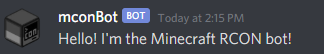

#  mconBot

> A bot to interact with your Minecraft server - from Discord! 

[](https://github.com/RayNieport/mconBot/commits/main)
[](https://github.com/RayNieport/mconBot/blob/main/LICENSE)

## What exactly does mconBot do?

mconBot allows you and your friends to easily control your Minecraft server from the comfort of Discord!
Minecraft servers use a protocol called [RCON](https://wiki.vg/RCON) to accept remote commands. If you're hosting your own server, you may have seen RCON mentioned in the server.properties file.

However, using RCON has some issues:
1. Port forwarding RCON to control your server over the internet is not very secure.
2. The RCON "user" has permission to run the full suite of Minecraft [commands](https://minecraft.fandom.com/wiki/Commands), without any restrictions.
3. There is only one RCON "user", so your friends can't log in to moderate the server unless you give them the credentials for unrestricted RCON access.

To solve these problems, mconBot does the following:
1. Uses Discord as an interface to eliminate the need for port forwarding or a VPN (mconBot is intended to be hosted on the same LAN as your Minecraft server). 
2. Solves permission issues using a three-tiered system of Users, Moderators, and Administrators. Higher tiers allow more sensitive commands to be executed.


## Nice! How do I get started?

__First__, enable RCON in the [server.properties](https://minecraft.fandom.com/wiki/Server.properties) file:
```
enable-rcon=true
rcon.password=<your passord>
rcon.port=25575
broadcast-rcon-to-ops=<optional, true|false>
```
__Second__, clone the git respository:
```
git clone https://github.com/RayNieport/mconBot.git
```

__Third__, create your instance of the bot at the [Discord Developer Portal](https://discord.com/developers/applications):
1. Click on the "New Application" button, and give your bot a name.
2. Give your bot a nice icon: the included icon is located at mconBot/images/mcon.png in the cloned repository.
3. Go to the OAuth2 page, scroll down to "Scopes", and select "bot". Under "Bot Permissions", select "View Channels" and "Send Messages".
4. Copy the link that was generated under "Scopes" and paste it into a new browser tab. Follow the instructions to add the bot to your Discord guild.
5. Head back to the Developer Portal and go to the Bot page. Uncheck "Public Bot", then copy the Token.

__Fourth__, modify __mconBot/src/.env__ in the cloned repository:
1. Paste the Discord Token aquired above into the appropriate field.
2. Fill in your Minecraft server's IP and RCON password.
3. Change the User, Mod, and Admin roles to the preffered roles in your Discord guild, or create the provided roles.

__Fifth__, head into __/mconBot/src/__ in the cloned repository and start up the bot:
```
python3 mconBot.py
```
__Finally__, test out your bot by sending the following into a text channel in your Discord guild:
```
>hi
```
You should get the following response:



For a list of all supported commands sorted by role, simply send the following:
```
>help
```

## What else is included in this repository?
1. If you're interested in running mconBot as a Docker container, the included __Dockerfile__ and __requirements.txt__ will allow you to build the image. I recommend running through all the steps above to test your bot before building the image.
2. If you want to modify which roles have access to certain commands, you can modify __mconBot/src/commands.json__. You should be able to add extra commands here as well, although this is not officially supported.
3. The __mconBot/mcon_pack/__ directory is a miecraft texture pack with modified furnace texture. This was used to generate the logo for the project. You can use this texture pack as an example if you want to create a custom minecraft-themed logo. For more info on creating your own logo, see the Licencse and Copyright section below.

## Donate

If you enjoy mconBot, consider [supporting my work](https://paypal.me/RayNieport) on this project and others! 

## License and Copyright

If you're interested in modifying or using my work for your own project, please see the LICENSE for up to date copyright and license information regarding mconBot. Please don't use my logo without asking first - you can make your own Minecraft themed logo by creating a [texture pack](https://minecraft.fandom.com/wiki/Tutorials/Creating_a_resource_pack) and rendering your modified asset using [Block Renderer](https://www.curseforge.com/minecraft/mc-mods/block-renderer). If you have suggestions for my project or make your own derivative, I'd love to hear about it!
